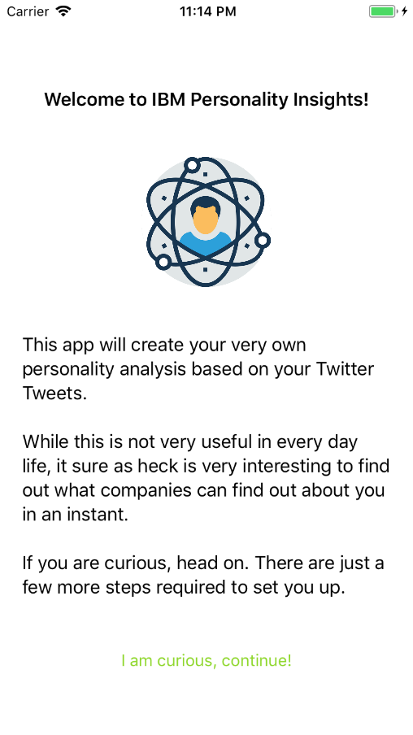
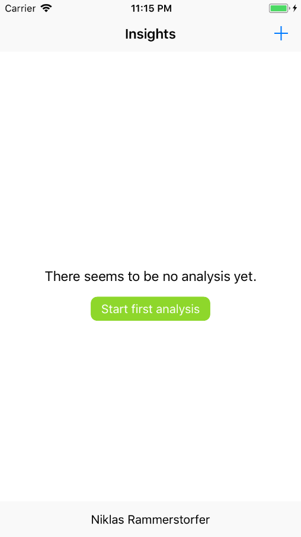
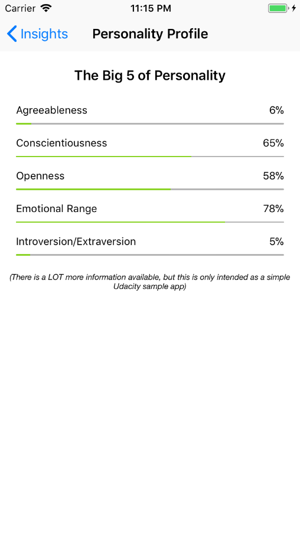

# Personality Insights (5/5 - Final Project)

This is the fifth part of a five part series of sample apps created for [Udacity's Nanodegree "Become an iOS Developer"](https://udacity.com/course/ios-developer-nanodegree--nd003).
The purpose of this app is to put together all learned concepts throughout the Nanodegree. All parts of the code have been developed by myself.

With Personality Insights you can connect your twitter account. Your Tweets are then downloaded and sent to IBM Watson (an artificial intelligence by IBM)
and a personality profile is created.

## Screenshots
  

## Getting Started

These instructions will get you a copy of the project up and running on your local machine for development and testing purposes.

### Prerequisites

* XCode version that is capable of supporting Swift 4.0

## Built With

* Twitter-Kit SDK (https://github.com/twitter/twitter-kit-ios)
* Personality Insights SDK (https://github.com/watson-developer-cloud/swift-sdk)

## Authors

* **Niklas Rammerstorfer** - *Initial work* - [Shanakor](https://github.com/Shanakor)
